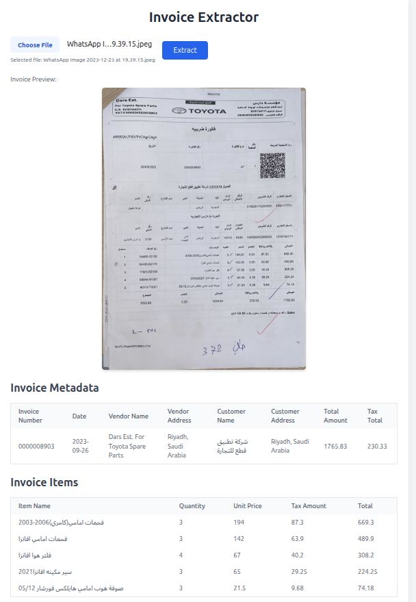

# Invoice System

This project is an invoice processing system that extracts information from invoice images.



## Description

The Invoice System is a Python-based application that uses generative AI to extract structured data from images of invoices. It provides a simple web interface to upload an invoice image and view the extracted information in JSON format.

## Getting Started

### Prerequisites

- Python 3.10+
- Git

### Cloning the Repository

```bash
git clone https://github.com/your-username/invoice_system.git
cd invoice_system
```

### Environment Configuration

1.  **Create a virtual environment:**

    ```bash
    python -m venv invoice_env
    source invoice_env/bin/activate
    ```

2.  **Install the dependencies:**

    ```bash
    pip install -r requirements.txt
    ```

3.  **Set up environment variables:**

    Create a `.env` file in the root of the project and add the following:

    ```
    GOOGLE_API_KEY="your_google_api_key"
    ```

## Usage

1.  **Run the application:**

    ```bash
    python3 app.py
    ```

2.  **Open your browser and navigate to:**

    ```
    http://127.0.0.1:5000
    ```

3.  **Upload an invoice image and see the extracted data.**

## Contributing

1. Fork the repository
2. Create a feature branch (`git checkout -b feature/amazing-feature`)
3. Commit your changes (`git commit -m 'Add amazing feature'`)
4. Push to the branch (`git push origin feature/amazing-feature`)
5. Open a Pull Request

## License

This project is licensed under the MIT License - see the LICENSE file for details.

## Support

If you encounter any issues or have questions:
- Open an issue on GitHub
- Review the code comments for implementation details

